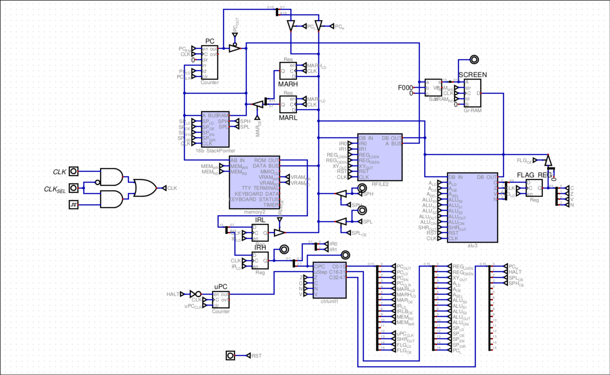

This document won't be an exhaustive breakdown on the previous model, but it will help clarify how the architecture was made.
## General description
The general architecture is the same as the new one, in the sense that it is a Von Neumann architecture, with an 8-bit data bus and a 16-bit address bus. 
### Specs
- This model does not have interrupts or perform [[../design-notes/03 Fetch-Execute Overlap]]
- It contains 4 General purpose registers (B,C,X,Y) ([[../design-notes/01 Register File Increment]])
- There are 2 bits dedicat[[../design-notes/01 Register File Increment]]ed to the register selector (bits IRH0-1)
- The opcode is 6 bits long (bits IRH2-7), meaning 64 available instructions
- The microstep counter has 4 dedicated bits ([[../design-notes/02 Microstep Counter Reduction]])
The rest of the CPU is either exactly the same as the newer version, or are changes that are not important enough to be mentioned.
## Bottlenecks
### Lack of registers
One of the main issues this design has is that only having 4 general purpose registers (plus the accumulator) forces the programmer to constantly use the RAM for almost everything.
### Cycle Inefficiency
This is related to the [[../design-notes/03 Fetch-Execute Overlap]]. This change felt natural just by seeing the amount of cycles that could be saved by making this change. 
## Design made in Digital

*Note that at the top right part, the SCREEN, is not how the actual OLED screen of the new design works, but since this was the only one available in the simulator, the connections had to be done that way.*

