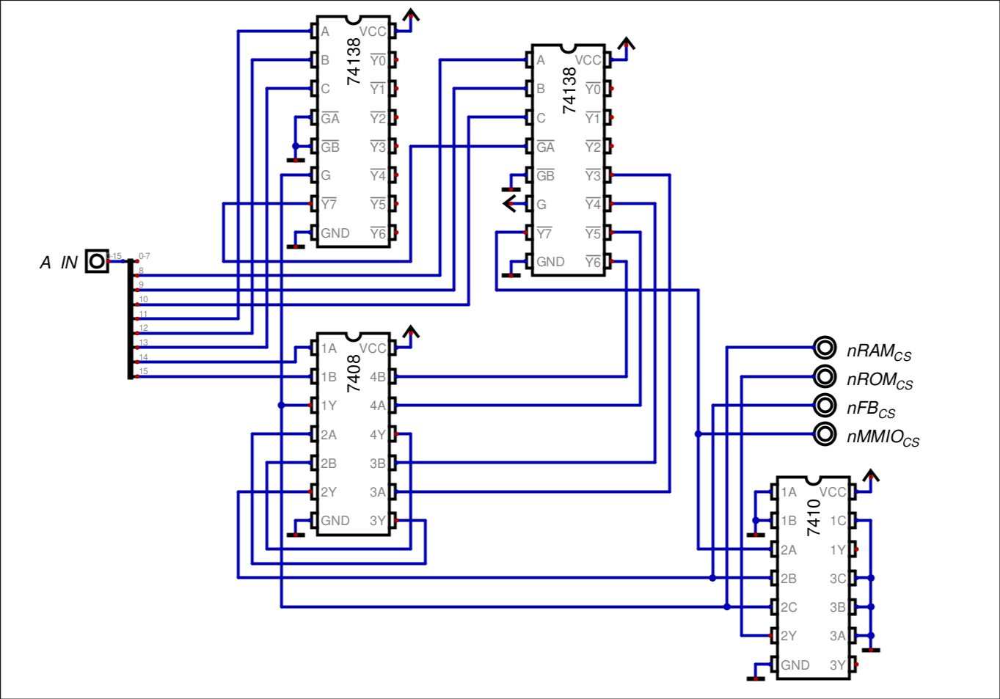

# ADDRESS DECODER

The address decoder is a module which (as the name says) decodes the chip selects of each memory module. In order to understand it work, let's see the memory map of the CPU, which will clarify what it actually does:

| Address Range   | Size  | Module                             | Active Signal |
| --------------- | ----- | ---------------------------------- | ------------- |
| `0x0000-0xBFFF` | 48 KB | RAM, stack & zero page             | `\RAM_CS`     |
| `0xC000-0xFBFF` | 15 KB | Firmware ROM                       | `\ROM_CS`     |
| `0xFC00-0xFEFF` | 1 KB  | OLED Framebuffer                   | `\FB_CS`      |
| `0xFF00-0xFFFF` | 256 B | MMIO registers & Interrupt vectors | `\MMIO_CS`    |
It's only job is to make sure that, when the address is on each address range, the specific active signal of each memory module activates, which since it's active low, goes to zero.

## Decoder Schematic Connections

