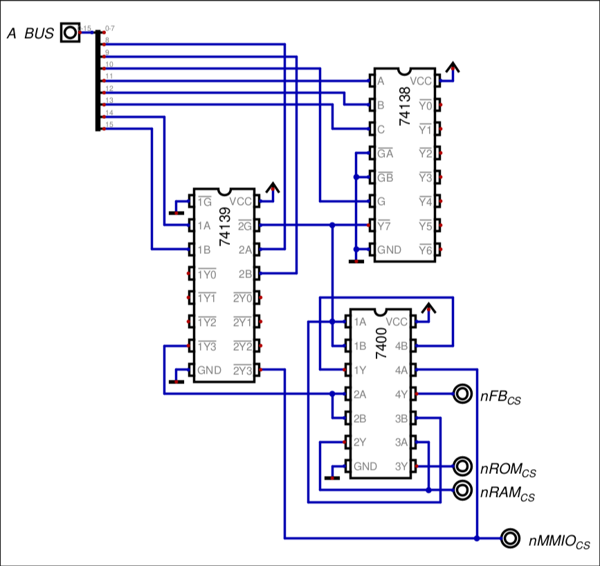

# ADDRESS DECODER

The address decoder is a module which (as the name says) decodes the chip selects of each memory module. In order to understand it work, let's see the memory map of the CPU, which will clarify what it actually does:

| Address Range   | Size  | Module                             | Active Signal |
| --------------- | ----- | ---------------------------------- | ------------- |
| `0x0000-0xBFFF` | 48 KB | RAM, stack & zero page             | `\RAM_CS`     |
| `0xC000-0xFBFF` | 15 KB | Firmware ROM                       | `\ROM_CS`     |
| `0xFC00-0xFEFF` | 1 KB  | OLED Framebuffer                   | `\FB_CS`      |
| `0xFF00-0xFFFF` | 256 B | MMIO registers & Interrupt vectors | `\MMIO_CS`    |
It's only job is to make sure that, when the address is on each address range, the specific active signal of each memory module activates, which since it's active low, goes to zero.

## Decoder Schematic Connections

(this is more useful to me so that i don't forget what i did)

First of all, there is a 74139 dual 2-to-4 decoder, which has as inputs A15 and A14, meaning that I divide the memory into 4 16KB blocks.

Out of these 4, only the last one I need, because that's the upper 16KB, which differenciates between ROM and RAM.

The other half of the 74139 is used with the addresses A9 and A8, and this is because it decodes into 4 256 B blocks, whose last output (2Y3) is exactly the
`nMMIO_CS` bit. It's the last, because its selector ONLY activates when address bits A15, A14, A13 and A12 are one, so it decodes perfectly as `0xFF00`.
