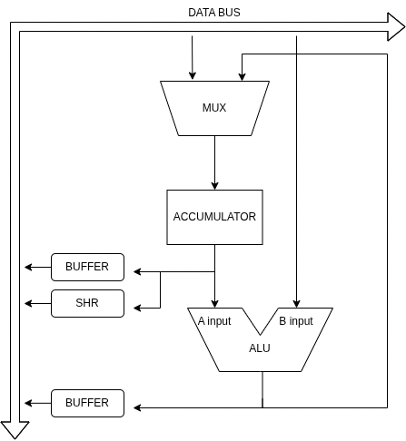
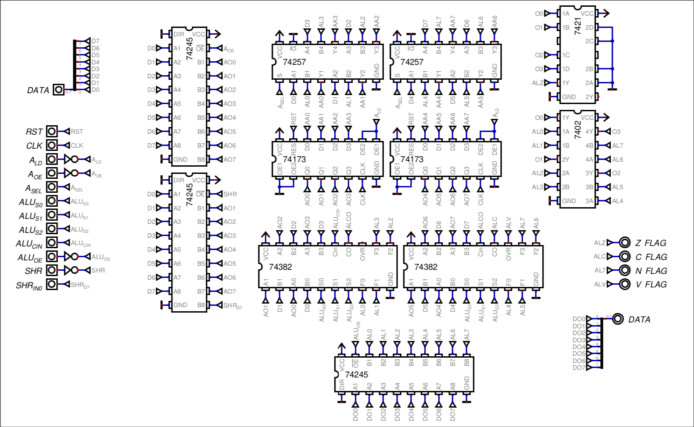

# ARITHMETIC LOGIC UNIT

Since this is an accumulator-based architecture, I want to start with the Arithmetic Logic Unit. This is the single most important component of the CPU, and designing it first establishes the core datapath that the microcode unit, the register file, etc. will build upon.
## Hardware Architectural Overview

Block diagram of the ALU module:

- Input A: Hardwired directly to the output of the accumulator
- Input B: Connected to the data bus
- Output path: Connected to the second input of a mux for the input of the accumulator and also connected to a buffer that outputs to the data bus.
- Accumulator output: Although its constantly outputting to the input A of the ALU, it's connected to 3 buffers, which enable normal output, shift right or roll over right right through carry, all to the data bus.
## Control Pins & Operation Table

### 74382 Core logic (ALU)

| Instruction | S2  | S1  | S0  | Cin      | Selected Operation |
| ----------- | --- | --- | --- | -------- | ------------------ |
| ADD/ADI     | 0   | 1   | 1   | 0        | $A+B$              |
| ADC         | 0   | 1   | 1   | `C_FLAG` | $A+B+C$            |
| SUB/CP/CPI  | 0   | 1   | 0   | 1        | $A-B$              |
| SBC         | 0   | 1   | 0   | `C_FLAG` | $A-B-1+C$          |
| INC A       | 0   | 1   | 1   | 1        | $A+0+1$            |
| DEC A       | 0   | 1   | 0   | 0        | $A-0-1$            |
| AND/ANI     | 1   | 1   | 0   | X        | $A\&B$             |
| OR          | 1   | 0   | 1   | X        | $A \| B$           |
| XOR         | 1   | 0   | 0   | X        | $A\oplus B$        |
### Datapath Routing & Peripheral Control

| Instruction Group  | B-input Source | Shift MUX (D7)     | Output Bus Source      |
| ------------------ | -------------- | ------------------ | ---------------------- |
| ALU Math / Logic   | Data bus       | Ignored            | 74382 Outputs          |
| Compare (CP / CPI) | Data bus       | Ignored            | 74382 Outputs          |
| INC A / DEC A      | Force 0        | Ignored            | 74382 Outputs          |
| SHR A              | Disconnected   | Driven to 0        | Shifter buffer         |
| ROR A              | Disconnected   | Driven to `C_FLAG` | Shifter buffer         |
| MOV A, reg         | Disconnected   | Ignored            | Main Data Bus (Bypass) |
## Status Flag Generation Logic

| Flag | Name     | Hardware Derivation               | Formula                                           |
| ---- | -------- | --------------------------------- | ------------------------------------------------- |
| Z    | Zero     | Cascaded NOR/AND zero-detect tree | $Z = \overline{Y_0 \lor Y_1 \lor \dots \lor Y_7}$ |
| C    | Carry    | Carry-out pin of MSB adder stage  | $C = C_{out7}$                                    |
| N    | Negative | Most Significant Bit of result    | $N = Y_7$                                         |
| V    | Overflow | Overflow pin of MSB adder stage   | $V = V_{7}$                                       |
## ICs Hardware Logic

