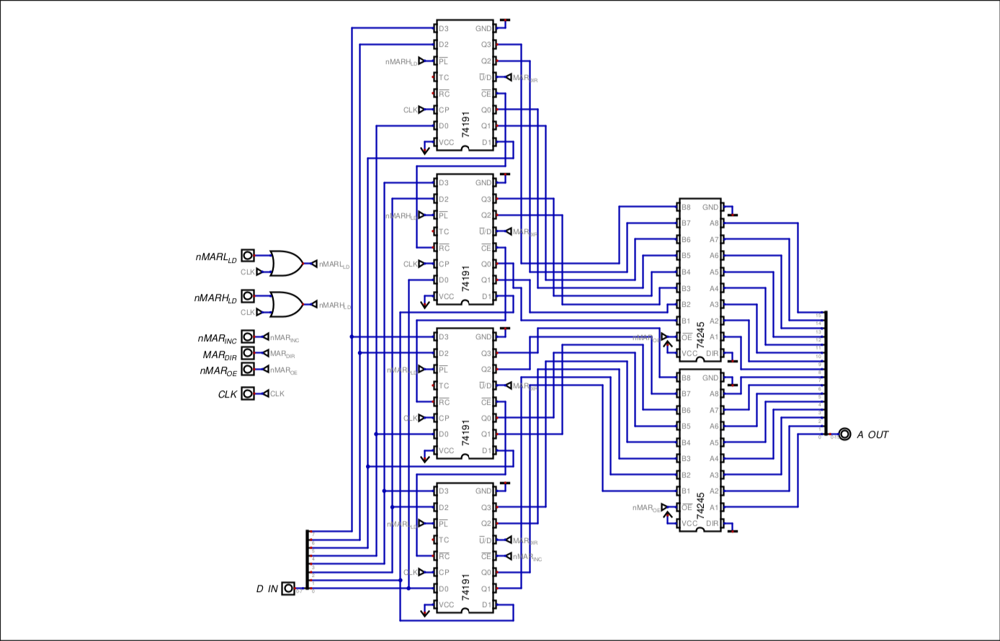

# MEMORY ADDRESS REGISTER (MAR)

## Overview & Memory Layout

The Memory Address Register (MAR) is a 16-bit synchronous up/down counter with parallel load and tri-state outputs.It acts as the bridge between the internal data bus and the external address bus. Without it, the CPU could not perform 16-bit jumps or access the entire 64 KB RAM.

Unlike the XY register pair, the MAR is not a general purpose "programmer-visible" register. It is an implicit register, the CPU uses it automatically for memory reads, writes and several pseudoinstructions.

The MAR is split into two parts, the lower byte: MARL and the higher byte: MARH

It can be loaded one byte at a time from the data bus, incremented, decremented, or driven into the address bus.

## Hardware Architecture & Data Path

The MAR is built using x4 4-bit up/down counters, chained together to behave as a 16-bit counter. Parallel load inputs allow bytes to be written into MARL or MARH, which is decoded as sub-opcodes of the instruction.

The tri-state buffers connect the MAR to the address bus.

## Control Signals & Operation Logic

| Signal     | Active Level | Function                                               |
| ---------- | ------------ | ------------------------------------------------------ |
| `nMARL_LD` | LOW          | Enables parallel load into MARL                        |
| `nMARL_LD` | LOW          | Enables parallel load into MARH                        |
| `nMAR_OE`  | LOW          | Drives the MAR onto the Address bus                    |
| `nMAR_INC` | LOW          | Enables counting on the 74191s                         |
| `MAR_DIR`  | HIGH         | Sets counter direction (LOW for `INC`, HIGH for `DEC`) |
### Operations

| Operation                 | Signals triggered     | Cycles    |
| ------------------------- | --------------------- | --------- |
| MOV MARL, Imm/REG         | `nMARL_LD`            | 2         |
| MOV MARH, Imm/REG         | `nMARH_LD`            | 2         |
| LD REG, MAR / ST MAR, REG | `nMAR_OE`             | 2         |
| JCC MAR / CALL MAR / RET  | `nMAR_OE`             | 2 / 4 / 5 |
| INC MAR                   | `nMAR_INC`            | 2         |
| DEC MAR                   | `nMAR_INC`, `MAR_DIR` | 2         |
## Timing, Latches & Critical Paths

The MAR counters are synchronous and edge-triggered. Their outputs change only on the rising clock edge, after the counter propagation delay `t_pd`. This is the same principle as the Stack Pointer.

## Design Justifications

### Dedicated Up/Down Counter instead of a Plain Register

A plain register would only enable me to save data and output address. Without an incrementing/decrementing MAR, copying a block of RAM from one buffer to another would require constantly updating MAR byte-by-byte using register transfers.
In order to avoid using more tri-state buffers and wire the MAR output to the data bus, making the ALU compute the INC/DEC, I decided to make the MAR itself an up/down counter, which saves cycles and keeps the ALU free for arithmetic.

### Implicit MAR vs General-Purpose XY

XY are programmer-visible up/down counters that can also drive the address bus. The MAR is implicit and dedicated to memory access. Keeping them separate means the CPU can use XY for pointers/indexing while the MAR holds the address for the current memory instruction.
