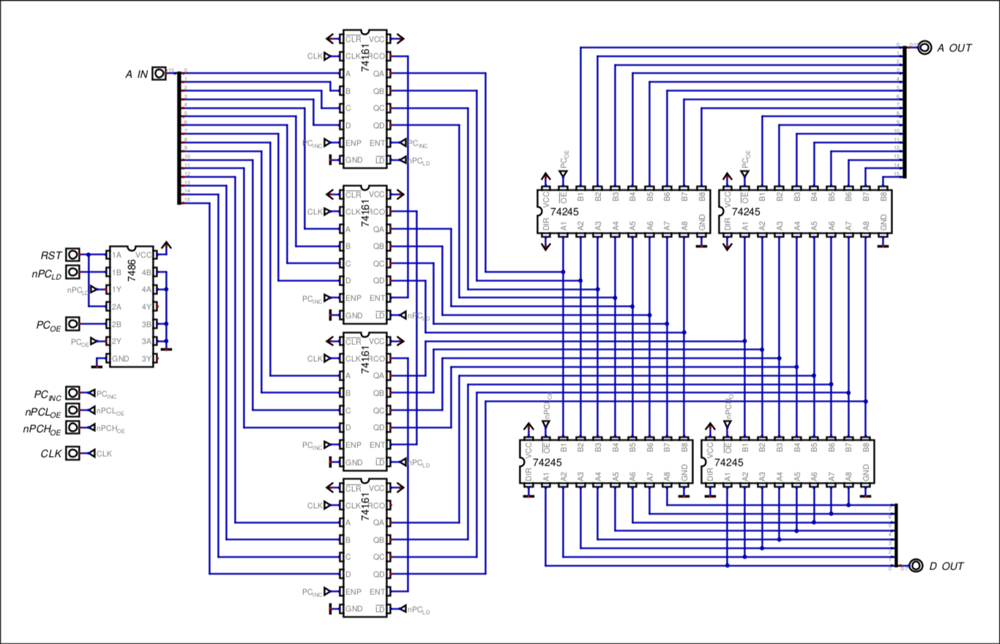

# PROGRAM COUNTER

## Overview & Memory Layout

The Program Counter, or _PC_, is a 16-bit register that holds the address of the next instruction to be fetched. It is implemented as a 16-bit synchronous up counter with parallel load, using four 74161 4-bit binary counters.
### Initialization

At reset, the PC loads the hardwired vector `0xC000`, which is the start of ROM. This guarantees that after reset the CPU begins executing from a known location instead of `0x0000`.

## Hardware Architecture & Data Path

The PC is built from four 74161 4-bit synchronous binary counters cascaded into a single 16-bit counter. The output of the PC is driven either onto the address bus, for normal fetching operations, or the data bus, for loading the PC into the RAM.

### Reset Circuit

Initially the PC is outputting at address `0x0000`, meaning the address decoder is selecting the RAM. Since the ROM is not the one selected, it means the instruction register, and therefore the Control Unit's opcode is 0.

In order to latch the hardwired vector `0xC000` on the PC, the load signal must be able to save normally during software instructions, but also when a physical reset button is pressed.

| Reset button | nPC_LD | Output (/LD) |
| ------------ | ------ | ------------ |
| 0            | 0      | 0            |
| 0            | 1      | 1            |
| 1            | 0      | 1            |
| 1            | 1      | 0            |

This fits the exact table truth of an XOR gate.

It is also important to deactivate the output of the the program counter, which is normally outputting to the address bus, and coincidentally, it follows the exact same table truth of the load operation.

| Reset button | PC_OE | Output (/OE) |
| ------------ | ----- | ------------ |
| 0            | 0     | 0            |
| 0            | 1     | 1            |
| 1            | 0     | 1            |
| 1            | 1     | 0            |

In this case, the `/OE` is the bit corresponding to the 74245 Tri-State buffer connecting the outputs of the PC to the address bus.

## Control Signals & Operations

| Signal    | Active Level | Function                                                             |
| --------- | ------------ | -------------------------------------------------------------------- |
| `PC_INC`  | HIGH         | Enables incrementing on the 74161s                                   |
| `nPC_LD`  | LOW          | Enables parallel load into the PC from address bus                   |
| `PC_OE`   | *HIGH        | Drives the PC onto the address bus                                   |
| `nPCL_OE` | LOW          | Enables parallel load into the PCL from data bus                     |
| `nPCH_OE` | LOW          | Enables parallel load into the PCH from data bus                     |
| `RST`     | HIGH         | Forces PC load from hardwired vector and disables address-bus output |
_*note: the `PC_OE` is active LOW, but for the sake of convenience it's put as active high. It's done that way so that the microprogrammer doens't need to activate it on every "normal" instruction_

### Operations

## Timing, Latches & Critical Paths

The 74161 is a synchronous, edge-triggered counter. Its outputs change only on the rising edge of the clock, after the internal propagation delay `t_pd`.

## Design Justifications

### 74161 instead of 74191

The PC only needs to increment and load. It never needs to decrement. The 74161 is a dedicated up counter with parallel load, so it requires fewer control signals than the 74191. This makes the wiring simpler and the control logic smaller. The 74191 is still used for the Stack Pointer, MAR and XY register pair, because those need both increment and decrement.