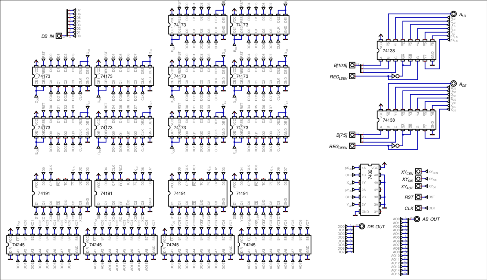

# REGISTER FILE

The register file consists of 7, 8-bit GPRs, from which the first 5 are regular registers and the last two work as a up/down counter that can output data to the address bus in 1 cycle.

Bits `[10:8]` are connected to the demux of the register destination, and bits `[7:5]` are connected to the demux of the source register. Since they are 3 bits wide, the demux gives up to 8 possible combinations. Out of the 8, the first one (or default) is the accumulator, shown in the ALU. The 7 left are the registers which can be seen here:

(picture of the block diagram)

## XY Registers as a pointer pair

The X and Y registers work as normal registers, since they can be accessed the same as any other register, but the key difference is that they can output at the same time to the 16-bit address bus.
The decision to have both X and Y registers be up/down counters is that, given that incrementing any register that's not the accumulator takes 3 instructions, and since these two registers work as a pointer, it's very common to need a quick increment or decrement, and having it ingrained was practically free (in terms of hardware), so I decided to make them work that way.

## ICs Logic

The Register file contains 74173 registers which paired up form an 8-bit register with a load enable and output enable in them. For the up/down counter, 74191 chips are also paired to make the 8-bit register, but these do not contain buffers for the output, so 2 74245 bi-directional buses are used, one for the output to the data bus, and one for the data to the address bus.

