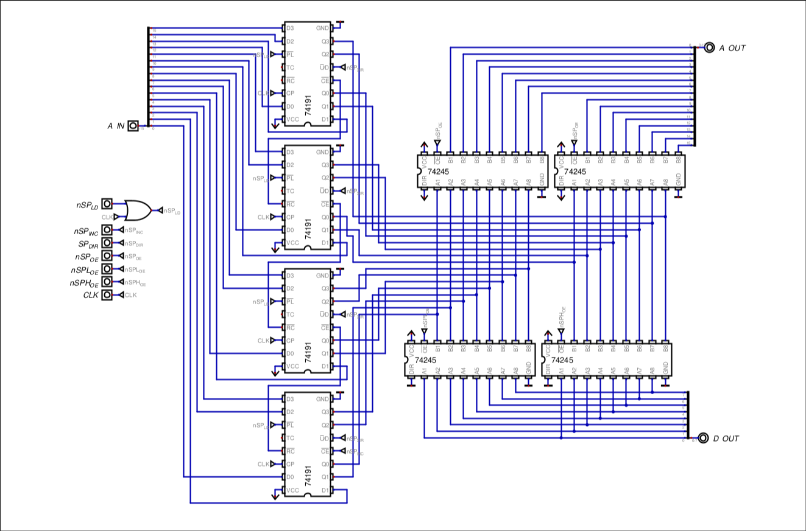

# STACK POINTER

## Overview & Memory Layout

The Stack Pointer, or _SP_, is a 16-bit register that points to the Stack, which is a section of the RAM, in which temporary data is stored.
The SP is divided into two registers, named SPL (the low byte of the SP) and SPH (the high byte of the SP).

The Stack Pointer follows an Empty Stack convention with downward growth, meaning the SP points to the next available unallocated memory address rather than the last pushed element.
### Initialization

At the start of the program, the Stack Pointer is loaded via software with the address `0x3FFF`, which is the start of the Stack, and exactly the end of RAM.

## Hardware Architecture & Data Path

The SP uses 4 up/down counters in order to be able to access the entire address of memory. For its outputs, and in order to connect to both the address and data bus, tri-state ICs were utilized.

(missing screenshot of block diagram/abstracted design)

As seen in the diagram, x4 74191 (4-bit Synchronous Up/Down Binary Counters) and x4 74245 (8-bit Tri-State Buffers) are used. The 74191 is the actual Stack Pointer, while the buffers are used to chose between not outputing the SP to the address bus, output it directly to the address bus, or chose either the SPL or SPH to output to the data bus.

## Control Signals & Operation Logic

| Signal    | Active Level | Function                                                |
| --------- | ------------ | ------------------------------------------------------- |
| `nSP_INC` | LOW          | Enables counting on the 74191s                          |
| `SP_DIR`  | HIGH         | Sets counter direction (HIGH for `PUSH`, LOW for `POP`) |
| `nSP_LD`  | LOW          | Enables parallel data loading on the 74191s             |
| `nSP_OE`  | LOW          | Drives 16-bit SP address onto the Address Bus           |
| `nSPL_OE` | LOW          | Drives SPL onto the Data bus                            |
| `nSPH_OE` | LOW          | Drives SPH onto the Data bus                            |
## Timing, Latches & Critical Paths

The 74191 is a fully synchronous edge-triggered counter, and its outputs transition ONLY on the rising edge of the clock input.
Now, the difference in execution cycles between `PUSH` and `POP` operations can be explained this way:
### PUSH (1 Cycle)

The Stack Pointer points to the top of the stack (`0x3FFF`) and, on a single cycle, the RAM stores the current information from a register that is on the data bus on the current address the SP is pointing to, which is then decremented.

During execution of step 1, SP drives a completely stable address onto the bus. 
On the rising clock edge, the RAM latches the incoming register data simultaneously as SP decrements. Because SP does not change states until AFTER the clock edge triggers, no race condition or address instability occurs.
This happens because of the physical propagation delay (t_pd) of the 74HC191. Static RAM architectures have an address hold time requirement (t_h) of 0 ns relative to the active write edge. Because the 74HC191 has a propagation delay between 31 ns and 38 ns (at Vcc = 4.5V), the address remains driven on the bus well after the memory write cycle completes, completing safely the operation.

(an oscilloscope view of this will be done in the future)
### POP (2 Cycles)

The Stack Pointer is first pointing to the next address to be pushed, so the first thing that must be done is increment the SP, and on the next cycle, the RAM is read and copied to a register. That means the stack is LIFO (Last-in-First-Out).

Attempting to do a single-cycle `POP` is not possible, because the SP is pointing at an empty memory slot, so to solve this, the instruction is done in two steps.
First, the pointer is adjusted by doing an increment, and on the second cycle, the RAM can read the value because it is now pointing at the last pushed data.
It is for the exact same reason that the `PUSH` is able to be performed in one cycle that the `POP` is not.
## Design justifications

Dedicated Counters vs. ALU Routing
16-bit SP instead of 8-bit SP
Downwards growth

