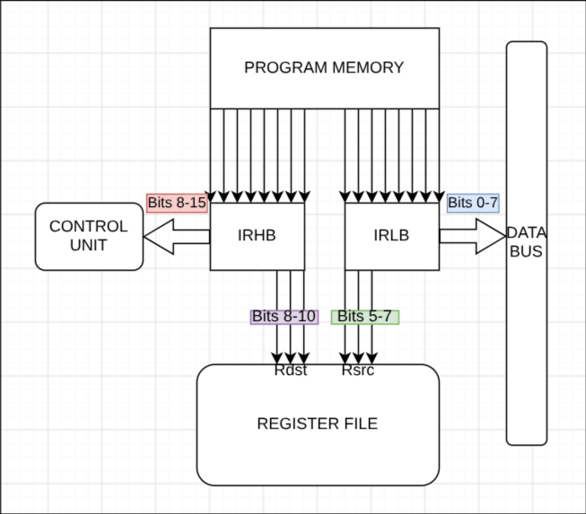

# INSTRUCTION DECODING & SUBEXTENDED OPCODE

Instructions are loaded directly from memory into two 8-bit registers. The lower one, called IRLB holds bits `[7:0]`, while the higher one, IRHB holds bits `[15:8]`.

This division is done so that the IRLB is the one outputting the data onto the data-bus only when the buffer allows it, and IRHB is constantly outputting its data to the control unit.

## Bit Encoding 

Although the entire 8 bits are connected to the control unit, for most of the instructions, it is as if there are only 5 connected (bits `[15:11]`). This is because I originally planned on having only 5 bits as opcode, while the other 3 (bits `[10:8]`) work as the decoder for the register to be written to. 

Although this is how it mainly works, I realized that by connecting the 3 bits that are also connected to the register decoder to the control unit, I could take advange of the instructions that don't use registers or immediates, and since there are exactly 8, I could decode 1 instruction into 8 subinstructions.

This same strategy of using the 3 bits `[10:8]` to get subinstructions is used for the conditional jumps, since there are 4 flags, up to 8 conditional jumps are needed, which is covered with 1 instruction, decoding those 3 bits. The last use is for the MAR. Since the data is 8 bits, I'd need two separate instructions (for MARL and MARH), but if I looked at bit `[8]` I could select one from another, saving 1 instruction.

Also, this usage of 3 bits for the destination is done for the source, but on bits `[7:5]`, so that an instruction that requires moving between two registers, since it doesn't need to use the data bus, it could use those bits to decode the output of the register wanted on the register file. Of couse, when data is needed, although they are pointer to the decoder, no output is done, and the bus "stays clean".

The way these bits are allocated is the following:

- Bits `[15:11]` --> Base Opcode
- Bits `[15:8]` --> Entire Opcode (for subinstructions)
- Bits `[10:8]` --> Destination Register Select (Rdst)
- Bits `[7:5]`  --> Source Register Select (Rsrc)
- Bits `[7:0]`  --> Immediate 8-bit data

## Table of Instruction Classes & Bit Encoding

| Instruction class                         | Opcode [15:8] | Rdst [10:8]            | Rsrc [7:5]  | Imm [7:0]      |
| ----------------------------------------- | ------------- | ---------------------- | ----------- | -------------- |
| **Dual Register**  `ADD R1, R2`        | 5-bit Op      | Target Rdst            | Source Rsrc | (ignored)      |
| **Register-immediate**  `MOV R1, 0x12` | 5-bit Op      | Target Rdst            | (ignored)   | 8-bit data     |
| **Single-Register**  `INC R1, PUSH R2` | 5-bit Op      | Target Rdst            | (ignored)   | (ignored)      |
| **Conditional Jump**  `JZ 0x80`        | 5-bit Op      | Conditional Code (0-7) | (ignored)   | Target address |
| **No-operand**  `NOP, HALT`            | 8-bit Op      | (ignored)              | (ignored)   | (ignored)      |
